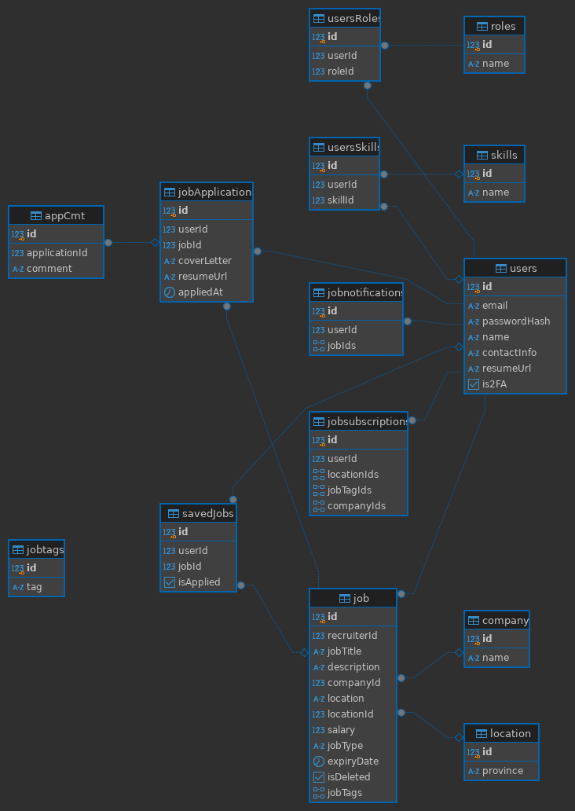
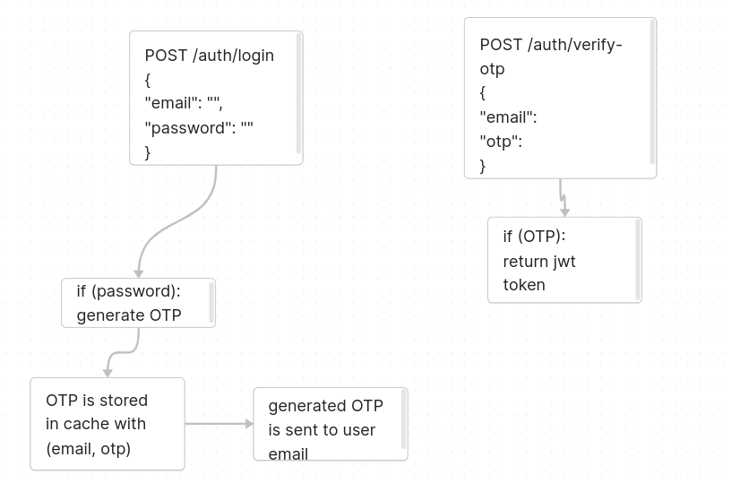

## Note

- Database schema

  

- The job recommendation in task 6 was built using the **Full Text Search** feature from PostgreSQL.
  
- The 2FA service workflow:
  
  

- **Job Reminder:**
Find all saved job of users and send to their email if they havent applied yet.

- 

- **Job Subscription:** Send all jobs that match user subscription 2 times per day.
    The criteria for adding a job to a user's subscription list are as follows:

    1. **Company Match**: 
        - The job's company ID must be in the user's subscribed company IDs. 
        - If the user has an empty list of company IDs, this condition is considered satisfied.

    2. **Job Tag Match**: 
        - At least one of the job's tags must match the user's subscribed job tags. 
        - If the user has an empty list of job tags, this condition is also satisfied.

    3. **Location Match**: 
        - The job's location ID must be in the user's subscribed location IDs. 
        - If the user has an empty list of location IDs, this condition is considered satisfied.

    If all three conditions are met for a user, the job ID is added to their job notification list. If a user already has a job notification entry, the job ID is appended to their existing list. If no entry exists, a new job notification entry is created for the user with the job ID.

---

## Requirements

- **JDK**: 17 or higher

---

## Configuration

If you want to:
- Test the RabbitMQ email service
- Test the email-based 2FA service
- Test the job reminder, subscription service

Go to `application.yml`:

- Change spring profile to `test` instead of `prod`, this will enable Job Reminder feature to run every 5 minutes instead of every 8AM:
```yaml
spring:
  profiles:
    active: test
```

- Replace your email in order to receive notifications:

```yaml
test:
    email: youremail@gmail.com
```

### User Accounts

- **User Account:**  
  - **Email:** `user@gmail.com`  
  - **Password:** `string`  

- **Admin Account:**  
  - **Email:** `admin@gmail.com`  
  - **Password:** `string`  

---

## How to Run

1. **Open Terminal** and execute the following commands:

   ```bash
   git clone .....
   cd ....
   ```

2. **Start Docker Compose**:

   PostgreSQL will run on port `5430`, RabbitMQ will run on ports `5672` and `15672`:

   ```bash
   docker compose up -d
   ```

3. **Make sure to have JDK 17 or higher in your local machine**.

4. **Run the Application**:

   ```bash
   ./mvnw spring-boot:run
   ```

---

## To Read

- [Hibernate LazyInitializationException](https://stackoverflow.com/questions/7654818/org-hibernate-lazyinitializationexception-could-not-initialize-proxy-no-sessi)

---

## Reference

- [Hypersistence Utils GitHub Repository](https://github.com/vladmihalcea/hypersistence-utils)

---

